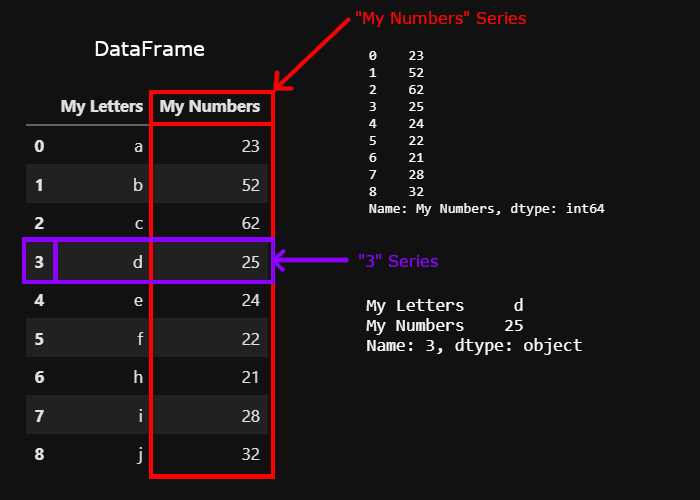

# The Fundamentals of Pandas
Pandas is a data analysis library for python that enables powerful and easy ingress, manipulation, and storage of data. This notebook will cover some of the basics of using the Pandas library, for more extensive information, please visit the offical documentation [here](https://pandas.pydata.org/).\
\
The notebook is broken into 5 sections for mastering the basics of Pandas:
### Table of Contents
0. <a href="#0) Pandas Setup">Pandas Setup</a>
1. <a href="#1) Pandas Data Structures">Pandas Data Structures</a>
    * <a href="#Series">Series</a>
    * <a href="#DataFrames">DataFrames</a>
2. <a href="#2) Creating DataFrames">Creating DataFrames</a>
    * <a href="#A list of dictionaries">A list of dictionaries</a>
    * <a href="#A dictionary of lists">A dictionary of lists</a>
    * <a href="#Reading from a SQL database">Reading from a SQL database</a>   
    * <a href="#Web Scraping a table">Web Scraping a table</a>
    * <a href="#Reading from a CSV">Reading from a CSV</a>
3. <a href="#3) Reading data from a DataFrame">Reading data from a DataFrame</a>
    * <a href="#Keys/Indexing">Keys/Indexing</a>
    * <a href="#Using iloc[ ]">Using iloc[ ]</a>
    * <a href="#Using loc[ ]">Using loc[ ]</a>
    * <a href="#Conditional views">Conditional views</a>
4. <a href="#4) Data Manipulation in Pandas">Data Manipulation in Pandas</a>
    * <a href="#Drop">Drop</a>
    * <a href="#DropNA">DropNA</a>
    * <a href="#Duplicated">Duplicated</a>
    * <a href="#Drop Duplicates">Drop Duplicates</a>
    * <a href="#At and Iat">At and Iat</a>
    * <a href="#Append">Append</a>
    * <a href="#Join">Join</a>
    * <a href="#GroupBy">GroupBy</a>
    * <a href="#Binning Data">Binning Data</a>
5. <a href="#5) Views vs. Copies">Views vs. Copies</a>

## 0) Pandas Setup
To install Pandas, simply open a terminal and run ```pip install pandas```, or run the following cell to accomplish the same:


```python
!pip install pandas
```

    Requirement already satisfied: pandas in c:\python39\lib\site-packages (1.3.0)
    Requirement already satisfied: numpy>=1.17.3 in c:\python39\lib\site-packages (from pandas) (1.20.1)
    Requirement already satisfied: python-dateutil>=2.7.3 in c:\python39\lib\site-packages (from pandas) (2.8.1)
    Requirement already satisfied: pytz>=2017.3 in c:\python39\lib\site-packages (from pandas) (2021.1)
    Requirement already satisfied: six>=1.5 in c:\python39\lib\site-packages (from python-dateutil>=2.7.3->pandas) (1.10.0)
    

    WARNING: Ignoring invalid distribution -ip (c:\python39\lib\site-packages)
    WARNING: Ignoring invalid distribution -ip (c:\python39\lib\site-packages)
    WARNING: Ignoring invalid distribution -ip (c:\python39\lib\site-packages)
    WARNING: Ignoring invalid distribution -ip (c:\python39\lib\site-packages)
    WARNING: Ignoring invalid distribution -ip (c:\python39\lib\site-packages)
    WARNING: Ignoring invalid distribution -ip (c:\python39\lib\site-packages)
    WARNING: You are using pip version 21.1.2; however, version 21.2.1 is available.
    You should consider upgrading via the 'c:\python39\python.exe -m pip install --upgrade pip' command.
    

Next, we can import pandas for use in our script or notebook.


```python
# Importing Pandas as a dependency. We alias the library to "pd" using the "as" operator to make it shorter to write in our code.
import pandas as pd
```

<a id="1"></a>

## 1) Pandas Data Structures
Pandas features two major data structures: Series and DataFrames.

<a id="1.1"></a>
### Series
Series objects are indexed, one-dimensional arrays that behave similar to native python lists or dictionaries, as well as featuring several methods native to pandas.


```python
# A native python list
my_data = ["a","b","c","d","e","f","h","i","j"]

# Conversion to Pandas Series object
my_series = pd.Series(my_data)

# OPTIONAL: Naming our series
my_series.name = "My Letters"

# Printing out our Series
my_series
```


    0    a
    1    b
    2    c
    3    d
    4    e
    5    f
    6    h
    7    i
    8    j
    Name: My Letters, dtype: object


On the Left, the series index is visible, starting from 0. To the right is the data we created in our list. At the bottom, we can see the optional name we added to the series, as well as the datatype of the data within the series.

While this may not seem terribly impressive compared to a normal python list, this allows us to then use special pandas methods with our data. Below, the ```decribe()``` method is used to easily return statistical analysis on a set of data.


```python
my_data_2 = [24,52,62,22,24,22,22,28,32]
my_series_2 = pd.Series(my_data_2)
my_series_2
```


    0    24
    1    52
    2    62
    3    22
    4    24
    5    22
    6    22
    7    28
    8    32
    dtype: int64


```python
my_series_2.describe()
```


    count     9.000000
    mean     32.000000
    std      14.764823
    min      22.000000
    25%      22.000000
    50%      24.000000
    75%      32.000000
    max      62.000000
    dtype: float64


Note that the datatype for the "describe" result is different -that is because this is Series of it's own!


```python
type(my_series_2.describe())
```


    pandas.core.series.Series


You will also notice that the index for a Series does not always have to be numerical like a python list, but can can also be string based like a dictionary. Positions in the Series can thus accessed using the index like a list or dictionary.


```python
print(f"Accessing an item like a list: {my_series_2[0]}.")
print(f"Accessing an item like a dict: {my_series_2.describe()['count']}.")
```

    Accessing an item like a list: 24.
    Accessing an item like a dict: 9.0.
    

<a id="1.2"></a>
### DataFrames
The second major Pandas datatype is the DataFrame. A DataFrame is a tabular (table-like), 2-dimensional(i.e., rows and columns) object that is in many ways the central part of the pandas library. DataFrames are both indexed, like Series, and labeled. The index corresponds to the rows of the DataFrame while the labels correspond to the columns.


```python
# Iniitalizing a DataFrame using the first Series we created.
df = pd.DataFrame(my_series)

# Adding the second Series to the DataFrame
df["My Numbers"] = my_series_2

# Viewing the DataFrame
df
```


<div>
<style scoped>
    .dataframe tbody tr th:only-of-type {
        vertical-align: middle;
    }

    .dataframe tbody tr th {
        vertical-align: top;
    }

    .dataframe thead th {
        text-align: right;
    }
</style>
<table border="1" class="dataframe">
  <thead>
    <tr style="text-align: right;">
      <th></th>
      <th>My Letters</th>
      <th>My Numbers</th>
    </tr>
  </thead>
  <tbody>
    <tr>
      <th>0</th>
      <td>a</td>
      <td>24</td>
    </tr>
    <tr>
      <th>1</th>
      <td>b</td>
      <td>52</td>
    </tr>
    <tr>
      <th>2</th>
      <td>c</td>
      <td>62</td>
    </tr>
    <tr>
      <th>3</th>
      <td>d</td>
      <td>22</td>
    </tr>
    <tr>
      <th>4</th>
      <td>e</td>
      <td>24</td>
    </tr>
    <tr>
      <th>5</th>
      <td>f</td>
      <td>22</td>
    </tr>
    <tr>
      <th>6</th>
      <td>h</td>
      <td>22</td>
    </tr>
    <tr>
      <th>7</th>
      <td>i</td>
      <td>28</td>
    </tr>
    <tr>
      <th>8</th>
      <td>j</td>
      <td>32</td>
    </tr>
  </tbody>
</table>
</div>


The DataFrame features the same index as the Series used to create it's columns. Within the DataFrame, every row and column that makes it up is in fact its own Pandas Series. In other words, a DataFrame really is a matrix of intersecting Series!\



```python
df["My Numbers"].count()
```


    9


```python
df["My Numbers"].value_counts()
```


    22    3
    24    2
    62    1
    28    1
    52    1
    32    1
    Name: My Numbers, dtype: int64


<a id="2"></a>


## 2) Creating DataFrames
There are numerous ways to create data frames conveniently built into Pandas depending on the structure of our target data. The following are just a few of the most common:

<a id="2.1"></a>
### A list of dictionaries
This method is ideal for creating dictionaries from data generated within a loop, such as iterating over data from an API.


```python
# Create a series of dictionaries
my_dict_1 = {"Letters": "a", "Num_1": 23, "Num_2": 2}
my_dict_2 = {"Letters": "b", "Num_1": 26, "Num_2": 3}
my_dict_3 = {"Letters": "c", "Num_1": 32, "Num_2": 2}
my_dict_4 = {"Letters": "d", "Num_1": 21, "Num_2": 4}

# Add all of these dictionaries to a list
my_list = [my_dict_1, my_dict_2, my_dict_3, my_dict_4]

# Then convert that into a DataFrame
df = pd.DataFrame(my_list)
df
```


<div>
<style scoped>
    .dataframe tbody tr th:only-of-type {
        vertical-align: middle;
    }

    .dataframe tbody tr th {
        vertical-align: top;
    }

    .dataframe thead th {
        text-align: right;
    }
</style>
<table border="1" class="dataframe">
  <thead>
    <tr style="text-align: right;">
      <th></th>
      <th>Letters</th>
      <th>Num_1</th>
      <th>Num_2</th>
    </tr>
  </thead>
  <tbody>
    <tr>
      <th>0</th>
      <td>a</td>
      <td>23</td>
      <td>2</td>
    </tr>
    <tr>
      <th>1</th>
      <td>b</td>
      <td>26</td>
      <td>3</td>
    </tr>
    <tr>
      <th>2</th>
      <td>c</td>
      <td>32</td>
      <td>2</td>
    </tr>
    <tr>
      <th>3</th>
      <td>d</td>
      <td>21</td>
      <td>4</td>
    </tr>
  </tbody>
</table>
</div>


<a id="2.2"></a>
### A dictionary of lists
A dictionary of lists is a quick way to hand-write small data into a DataFrame.


```python
# Create a series of lists
column_a = ["a","b","c","d"]
column_b = [23,26,32,21]
column_c = [2,3,2,4]

# Insert them into a dictionary
my_dict = {"Letters": column_a, "Num_1": column_b, "Num_2": column_c}

# Then convert that into a DataFrame
df = pd.DataFrame(my_dict)
df
```


<div>
<style scoped>
    .dataframe tbody tr th:only-of-type {
        vertical-align: middle;
    }

    .dataframe tbody tr th {
        vertical-align: top;
    }

    .dataframe thead th {
        text-align: right;
    }
</style>
<table border="1" class="dataframe">
  <thead>
    <tr style="text-align: right;">
      <th></th>
      <th>Letters</th>
      <th>Num_1</th>
      <th>Num_2</th>
    </tr>
  </thead>
  <tbody>
    <tr>
      <th>0</th>
      <td>a</td>
      <td>23</td>
      <td>2</td>
    </tr>
    <tr>
      <th>1</th>
      <td>b</td>
      <td>26</td>
      <td>3</td>
    </tr>
    <tr>
      <th>2</th>
      <td>c</td>
      <td>32</td>
      <td>2</td>
    </tr>
    <tr>
      <th>3</th>
      <td>d</td>
      <td>21</td>
      <td>4</td>
    </tr>
  </tbody>
</table>
</div>


<a id="2.3"></a>
### Reading from a SQL database
Data can be read directly from SQL databases using Pandas. For this example, we will use sqlalchemy to quickly build a SQL database from a SQLite file.


```python
# Importing additional dependencies
!pip install --user sqlalchemy
from sqlalchemy import create_engine

# Path to SQLite file
database_path = "data_sources/Census_Data.sqlite"

# Creating the SQL database
engine = create_engine(f"sqlite:///{database_path}")

# Establisting a connection to our database
conn = engine.connect()

# Using pandas to read data out of SQL
census_data = pd.read_sql("SELECT * FROM Census_Data", conn)

# Because this DataFrame is so large, we will use the head() method to print out the top 5 entries.
census_data.head()
```

    Requirement already satisfied: sqlalchemy in c:\users\farad\appdata\roaming\python\python39\site-packages (1.4.21)
    Requirement already satisfied: greenlet!=0.4.17 in c:\python39\lib\site-packages (from sqlalchemy) (1.1.0)
    

    WARNING: Ignoring invalid distribution -ip (c:\python39\lib\site-packages)
    WARNING: Ignoring invalid distribution -ip (c:\python39\lib\site-packages)
    WARNING: Ignoring invalid distribution -ip (c:\python39\lib\site-packages)
    WARNING: Ignoring invalid distribution -ip (c:\python39\lib\site-packages)
    WARNING: Ignoring invalid distribution -ip (c:\python39\lib\site-packages)
    WARNING: Ignoring invalid distribution -ip (c:\python39\lib\site-packages)
    WARNING: You are using pip version 21.1.2; however, version 21.2.1 is available.
    You should consider upgrading via the 'c:\python39\python.exe -m pip install --upgrade pip' command.
    


<div>
<style scoped>
    .dataframe tbody tr th:only-of-type {
        vertical-align: middle;
    }

    .dataframe tbody tr th {
        vertical-align: top;
    }

    .dataframe thead th {
        text-align: right;
    }
</style>
<table border="1" class="dataframe">
  <thead>
    <tr style="text-align: right;">
      <th></th>
      <th>CityState</th>
      <th>city</th>
      <th>state</th>
      <th>Population</th>
      <th>White Population</th>
      <th>Black Population</th>
      <th>Native American Population</th>
      <th>Asian Population</th>
      <th>Hispanic Population</th>
      <th>Education None</th>
      <th>...</th>
      <th>Employment Female Computer Engineering</th>
      <th>Median Age</th>
      <th>Median Male Age</th>
      <th>Median Female Age</th>
      <th>Household Income</th>
      <th>Income Per Capita</th>
      <th>Median Gross Rent</th>
      <th>Median Home Value</th>
      <th>lat</th>
      <th>lng</th>
    </tr>
  </thead>
  <tbody>
    <tr>
      <th>0</th>
      <td>HOUSTON, TX</td>
      <td>HOUSTON</td>
      <td>TX</td>
      <td>3061887</td>
      <td>1775897</td>
      <td>684416</td>
      <td>11586</td>
      <td>230549</td>
      <td>1368287</td>
      <td>54180</td>
      <td>...</td>
      <td>22637</td>
      <td>33.439583</td>
      <td>32.550000</td>
      <td>34.363542</td>
      <td>56206.50000</td>
      <td>32239.52083</td>
      <td>956.708333</td>
      <td>178233.6842</td>
      <td>29.775734</td>
      <td>-95.414548</td>
    </tr>
    <tr>
      <th>1</th>
      <td>CHICAGO, IL</td>
      <td>CHICAGO</td>
      <td>IL</td>
      <td>2702091</td>
      <td>1318869</td>
      <td>843633</td>
      <td>7554</td>
      <td>161478</td>
      <td>785374</td>
      <td>32800</td>
      <td>...</td>
      <td>18209</td>
      <td>34.526786</td>
      <td>33.798214</td>
      <td>35.141071</td>
      <td>57735.96429</td>
      <td>38730.83929</td>
      <td>1119.928571</td>
      <td>264739.2857</td>
      <td>41.867838</td>
      <td>-87.673440</td>
    </tr>
    <tr>
      <th>2</th>
      <td>BROOKLYN, NY</td>
      <td>BROOKLYN</td>
      <td>NY</td>
      <td>2595259</td>
      <td>1126111</td>
      <td>870465</td>
      <td>8744</td>
      <td>297890</td>
      <td>509243</td>
      <td>48934</td>
      <td>...</td>
      <td>14845</td>
      <td>35.175676</td>
      <td>33.367568</td>
      <td>36.578378</td>
      <td>51469.18919</td>
      <td>28309.67568</td>
      <td>1261.783784</td>
      <td>605743.2432</td>
      <td>40.652805</td>
      <td>-73.956528</td>
    </tr>
    <tr>
      <th>3</th>
      <td>LOS ANGELES, CA</td>
      <td>LOS ANGELES</td>
      <td>CA</td>
      <td>2426413</td>
      <td>1068202</td>
      <td>324842</td>
      <td>15949</td>
      <td>273829</td>
      <td>1292382</td>
      <td>62684</td>
      <td>...</td>
      <td>12329</td>
      <td>35.335484</td>
      <td>34.535484</td>
      <td>36.061290</td>
      <td>47494.58333</td>
      <td>30073.19355</td>
      <td>1201.766667</td>
      <td>557115.0000</td>
      <td>34.042209</td>
      <td>-118.303468</td>
    </tr>
    <tr>
      <th>4</th>
      <td>MIAMI, FL</td>
      <td>MIAMI</td>
      <td>FL</td>
      <td>1820704</td>
      <td>1361009</td>
      <td>363514</td>
      <td>2250</td>
      <td>33144</td>
      <td>1162711</td>
      <td>27137</td>
      <td>...</td>
      <td>6969</td>
      <td>38.740741</td>
      <td>37.120370</td>
      <td>40.262963</td>
      <td>51232.90741</td>
      <td>25949.35185</td>
      <td>1260.833333</td>
      <td>243279.6296</td>
      <td>25.760268</td>
      <td>-80.298511</td>
    </tr>
  </tbody>
</table>
<p>5 rows × 31 columns</p>
</div>


Do not forget to shutdown the database when we are done with it!


```python
engine.dispose()
```

<a id="2.4"></a>
### Web Scraping a table
You can scrape table elements directly from HTML using Pandas.


```python
# Defining the URL to scrape from
url = "https://en.wikipedia.org/wiki/List_of_the_highest_major_summits_of_North_America"

# Converting all table elements from the page into DataFrames. This method returns a list of DataFrames from the URL.
mountains_table_list = pd.read_html(url)

# Parsing through the list to find the table we want
mountains_table_list
```


    [     Rank                            Mountain peak                 Region  \
     0       1                Denali[a](Mount McKinley)                 Alaska   
     1       2                           Mount Logan[b]                  Yukon   
     2       3         Pico de Orizaba[c](Citlaltépetl)        Puebla Veracruz   
     3       4                     Mount Saint Elias[d]           Alaska Yukon   
     4       5                       Popocatépetl[e][f]  México Morelos Puebla   
     ..    ...                                      ...                    ...   
     396   396                          Sierra Fría[my]         Aguascalientes   
     397   398                    Hayford Peak[147][mz]                 Nevada   
     398   399  Ulysses Mountain[na][nb](Mount Ulysses)       British Columbia   
     399   400                      Eagle Peak[148][nc]             California   
     400   401                   Sacajawea Peak[nd][ne]                 Oregon   
     
                   Mountain range  Elevation Prominence Isolation  \
     0               Alaska Range  20,310 ft  20,146 ft       NaN   
     1      Saint Elias Mountains  19,551 ft  17,215 ft    387 mi   
     2    Cordillera Neovolcanica  18,491 ft  16,148 ft       NaN   
     3      Saint Elias Mountains  18,009 ft  11,250 ft   25.6 mi   
     4    Cordillera Neovolcanica  17,749 ft   9,974 ft   88.8 mi   
     ..                       ...        ...        ...       ...   
     396  Sierra Madre Occidental   9,941 ft   1,640 ft  145.6 mi   
     397              Sheep Range   9,924 ft   5,412 ft   33.8 mi   
     398            Muskwa Ranges   9,921 ft   7,526 ft    271 mi   
     399         Warner Mountains   9,895 ft   4,362 ft   87.4 mi   
     400        Wallowa Mountains   9,843 ft   6,393 ft  125.5 mi   
     
                                                   Location  
     0    .mw-parser-output .geo-default,.mw-parser-outp...  
     1      60°34′02″N 140°24′20″W / 60.5671°N 140.4055°W  
     2        19°01′50″N 97°16′11″W / 19.0305°N 97.2698°W  
     3      60°17′34″N 140°55′51″W / 60.2927°N 140.9307°W  
     4        19°01′21″N 98°37′40″W / 19.0225°N 98.6278°W  
     ..                                                 ...  
     396    22°16′26″N 102°36′26″W / 22.2739°N 102.6073°W  
     397    36°39′28″N 115°12′03″W / 36.6577°N 115.2008°W  
     398    57°20′47″N 124°05′34″W / 57.3464°N 124.0928°W  
     399    41°17′01″N 120°12′03″W / 41.2835°N 120.2007°W  
     400    45°14′42″N 117°17′34″W / 45.2450°N 117.2929°W  
     
     [401 rows x 8 columns],
       .mw-parser-output .navbar{display:inline;font-size:88%;font-weight:normal}.mw-parser-output .navbar-collapse{float:left;text-align:left}.mw-parser-output .navbar-boxtext{word-spacing:0}.mw-parser-output .navbar ul{display:inline-block;white-space:nowrap;line-height:inherit}.mw-parser-output .navbar-brackets::before{margin-right:-0.125em;content:"[ "}.mw-parser-output .navbar-brackets::after{margin-left:-0.125em;content:" ]"}.mw-parser-output .navbar li{word-spacing:-0.125em}.mw-parser-output .navbar-mini abbr{font-variant:small-caps;border-bottom:none;text-decoration:none;cursor:inherit}.mw-parser-output .navbar-ct-full{font-size:114%;margin:0 7em}.mw-parser-output .navbar-ct-mini{font-size:114%;margin:0 4em}.mw-parser-output .infobox .navbar{font-size:100%}.mw-parser-output .navbox .navbar{display:block;font-size:100%}.mw-parser-output .navbox-title .navbar{float:left;text-align:left;margin-right:0.5em}vteNorth America  \
     0                                   Sovereign states                                                                                                                                                                                                                                                                                                                                                                                                                                                                                                                                                                                                                                                                                                                                                                                                                                                                                                                      
     1                  Dependencies andother territories                                                                                                                                                                                                                                                                                                                                                                                                                                                                                                                                                                                                                                                                                                                                                                                                                                                                                                                      
     
       .mw-parser-output .navbar{display:inline;font-size:88%;font-weight:normal}.mw-parser-output .navbar-collapse{float:left;text-align:left}.mw-parser-output .navbar-boxtext{word-spacing:0}.mw-parser-output .navbar ul{display:inline-block;white-space:nowrap;line-height:inherit}.mw-parser-output .navbar-brackets::before{margin-right:-0.125em;content:"[ "}.mw-parser-output .navbar-brackets::after{margin-left:-0.125em;content:" ]"}.mw-parser-output .navbar li{word-spacing:-0.125em}.mw-parser-output .navbar-mini abbr{font-variant:small-caps;border-bottom:none;text-decoration:none;cursor:inherit}.mw-parser-output .navbar-ct-full{font-size:114%;margin:0 7em}.mw-parser-output .navbar-ct-mini{font-size:114%;margin:0 4em}.mw-parser-output .infobox .navbar{font-size:100%}.mw-parser-output .navbox .navbar{display:block;font-size:100%}.mw-parser-output .navbox-title .navbar{float:left;text-align:left;margin-right:0.5em}vteNorth America.1  
     0  Antigua and Barbuda Bahamas Barbados Belize Ca...                                                                                                                                                                                                                                                                                                                                                                                                                                                                                                                                                                                                                                                                                                                                                                                                                                                                                                                       
     1  Anguilla Aruba Bermuda Bonaire British Virgin ...                                                                                                                                                                                                                                                                                                                                                                                                                                                                                                                                                                                                                                                                                                                                                                                                                                                                                                                       ,
       vteThe 124 highest major summits of greater North America  \
     0  .mw-parser-output .div-col{margin-top:0.3em;co...          
     
       vteThe 124 highest major summits of greater North America.1  
     0  .mw-parser-output .div-col{margin-top:0.3em;co...           ,
       vteThe 100 most prominent summits of greater North America  \
     0  Denali Mount Logan Pico de Orizaba Mount Raini...           
     
       vteThe 100 most prominent summits of greater North America.1  
     0  Denali Mount Logan Pico de Orizaba Mount Raini...            ,
       vteThe 107 most isolated major summits of greater North America  \
     0  Denali Gunnbjørn Fjeld Pico de Orizaba Mount W...                
     
       vteThe 107 most isolated major summits of greater North America.1  
     0  Denali Gunnbjørn Fjeld Pico de Orizaba Mount W...                 ,
       vteMountain peaks of North America  \
     0                   Sovereign states   
     1  Dependencies andother territories   
     
                     vteMountain peaks of North America.1  
     0  Antigua and Barbuda Bahamas Barbados Belize Ca...  
     1  Anguilla Aruba Bermuda Bonaire British Virgin ...  ]


```python
# It looks like the table we want is the second entry (Or now the first, as of the latest update) in the list of tables, so we will save it and print its head.
mountains_df = mountains_table_list[0]
mountains_df.head()
```


<div>
<style scoped>
    .dataframe tbody tr th:only-of-type {
        vertical-align: middle;
    }

    .dataframe tbody tr th {
        vertical-align: top;
    }

    .dataframe thead th {
        text-align: right;
    }
</style>
<table border="1" class="dataframe">
  <thead>
    <tr style="text-align: right;">
      <th></th>
      <th>Rank</th>
      <th>Mountain peak</th>
      <th>Region</th>
      <th>Mountain range</th>
      <th>Elevation</th>
      <th>Prominence</th>
      <th>Isolation</th>
      <th>Location</th>
    </tr>
  </thead>
  <tbody>
    <tr>
      <th>0</th>
      <td>1</td>
      <td>Denali[a](Mount McKinley)</td>
      <td>Alaska</td>
      <td>Alaska Range</td>
      <td>20,310 ft</td>
      <td>20,146 ft</td>
      <td>NaN</td>
      <td>.mw-parser-output .geo-default,.mw-parser-outp...</td>
    </tr>
    <tr>
      <th>1</th>
      <td>2</td>
      <td>Mount Logan[b]</td>
      <td>Yukon</td>
      <td>Saint Elias Mountains</td>
      <td>19,551 ft</td>
      <td>17,215 ft</td>
      <td>387 mi</td>
      <td>60°34′02″N 140°24′20″W / 60.5671°N 140.4055°W</td>
    </tr>
    <tr>
      <th>2</th>
      <td>3</td>
      <td>Pico de Orizaba[c](Citlaltépetl)</td>
      <td>Puebla Veracruz</td>
      <td>Cordillera Neovolcanica</td>
      <td>18,491 ft</td>
      <td>16,148 ft</td>
      <td>NaN</td>
      <td>19°01′50″N 97°16′11″W / 19.0305°N 97.2698°W</td>
    </tr>
    <tr>
      <th>3</th>
      <td>4</td>
      <td>Mount Saint Elias[d]</td>
      <td>Alaska Yukon</td>
      <td>Saint Elias Mountains</td>
      <td>18,009 ft</td>
      <td>11,250 ft</td>
      <td>25.6 mi</td>
      <td>60°17′34″N 140°55′51″W / 60.2927°N 140.9307°W</td>
    </tr>
    <tr>
      <th>4</th>
      <td>5</td>
      <td>Popocatépetl[e][f]</td>
      <td>México Morelos Puebla</td>
      <td>Cordillera Neovolcanica</td>
      <td>17,749 ft</td>
      <td>9,974 ft</td>
      <td>88.8 mi</td>
      <td>19°01′21″N 98°37′40″W / 19.0225°N 98.6278°W</td>
    </tr>
  </tbody>
</table>
</div>


<a id="2.5"></a>
### Reading from a CSV
One of the most common ways to ingress data using Pandas, the humble CSV.


```python
# Defining the CSV path
path = "data_sources/Census_Data.csv"

# Creating a DataFrame from the CSV
census_data = pd.read_csv(path)
census_data.head()
```


<div>
<style scoped>
    .dataframe tbody tr th:only-of-type {
        vertical-align: middle;
    }

    .dataframe tbody tr th {
        vertical-align: top;
    }

    .dataframe thead th {
        text-align: right;
    }
</style>
<table border="1" class="dataframe">
  <thead>
    <tr style="text-align: right;">
      <th></th>
      <th>CityState</th>
      <th>city</th>
      <th>state</th>
      <th>Population</th>
      <th>White Population</th>
      <th>Black Population</th>
      <th>Native American Population</th>
      <th>Asian Population</th>
      <th>Hispanic Population</th>
      <th>Education None</th>
      <th>...</th>
      <th>Employment Female Computer Engineering</th>
      <th>Median Age</th>
      <th>Median Male Age</th>
      <th>Median Female Age</th>
      <th>Household Income</th>
      <th>Income Per Capita</th>
      <th>Median Gross Rent</th>
      <th>Median Home Value</th>
      <th>lat</th>
      <th>lng</th>
    </tr>
  </thead>
  <tbody>
    <tr>
      <th>0</th>
      <td>HOUSTON, TX</td>
      <td>HOUSTON</td>
      <td>TX</td>
      <td>3061887</td>
      <td>1775897</td>
      <td>684416</td>
      <td>11586</td>
      <td>230549</td>
      <td>1368287</td>
      <td>54180</td>
      <td>...</td>
      <td>22637</td>
      <td>33.439583</td>
      <td>32.550000</td>
      <td>34.363542</td>
      <td>56206.50000</td>
      <td>32239.52083</td>
      <td>956.708333</td>
      <td>178233.6842</td>
      <td>29.775734</td>
      <td>-95.414548</td>
    </tr>
    <tr>
      <th>1</th>
      <td>CHICAGO, IL</td>
      <td>CHICAGO</td>
      <td>IL</td>
      <td>2702091</td>
      <td>1318869</td>
      <td>843633</td>
      <td>7554</td>
      <td>161478</td>
      <td>785374</td>
      <td>32800</td>
      <td>...</td>
      <td>18209</td>
      <td>34.526786</td>
      <td>33.798214</td>
      <td>35.141071</td>
      <td>57735.96429</td>
      <td>38730.83929</td>
      <td>1119.928571</td>
      <td>264739.2857</td>
      <td>41.867838</td>
      <td>-87.673440</td>
    </tr>
    <tr>
      <th>2</th>
      <td>BROOKLYN, NY</td>
      <td>BROOKLYN</td>
      <td>NY</td>
      <td>2595259</td>
      <td>1126111</td>
      <td>870465</td>
      <td>8744</td>
      <td>297890</td>
      <td>509243</td>
      <td>48934</td>
      <td>...</td>
      <td>14845</td>
      <td>35.175676</td>
      <td>33.367568</td>
      <td>36.578378</td>
      <td>51469.18919</td>
      <td>28309.67568</td>
      <td>1261.783784</td>
      <td>605743.2432</td>
      <td>40.652805</td>
      <td>-73.956528</td>
    </tr>
    <tr>
      <th>3</th>
      <td>LOS ANGELES, CA</td>
      <td>LOS ANGELES</td>
      <td>CA</td>
      <td>2426413</td>
      <td>1068202</td>
      <td>324842</td>
      <td>15949</td>
      <td>273829</td>
      <td>1292382</td>
      <td>62684</td>
      <td>...</td>
      <td>12329</td>
      <td>35.335484</td>
      <td>34.535484</td>
      <td>36.061290</td>
      <td>47494.58333</td>
      <td>30073.19355</td>
      <td>1201.766667</td>
      <td>557115.0000</td>
      <td>34.042209</td>
      <td>-118.303468</td>
    </tr>
    <tr>
      <th>4</th>
      <td>MIAMI, FL</td>
      <td>MIAMI</td>
      <td>FL</td>
      <td>1820704</td>
      <td>1361009</td>
      <td>363514</td>
      <td>2250</td>
      <td>33144</td>
      <td>1162711</td>
      <td>27137</td>
      <td>...</td>
      <td>6969</td>
      <td>38.740741</td>
      <td>37.120370</td>
      <td>40.262963</td>
      <td>51232.90741</td>
      <td>25949.35185</td>
      <td>1260.833333</td>
      <td>243279.6296</td>
      <td>25.760268</td>
      <td>-80.298510</td>
    </tr>
  </tbody>
</table>
<p>5 rows × 31 columns</p>
</div>


<a id="3"></a>

## 3) Reading data from a DataFrame
Now that we have our data in a DataFrame format, we need to be able to use it. The first thing we will want to learn to that end is how to read data back out!

<a id="3.1"></a>
### Keys/Indexing
We can parse a DataFrame similar to how we might a dictionary, selecting the column by using its label as a key.


```python
df['Letters']
```


    0    a
    1    b
    2    c
    3    d
    Name: Letters, dtype: object


We can further drill down using the index.


```python
df['Letters'][3]
```


    'd'


<a id="3.2"></a>
### Using iloc[ ]
Another option is to navigate the DataFrame entirely by numbers using ```iloc[ ]```. We can retrieve a whole column:


```python
df.iloc[:, 0] # Note the format here, [rows, columns]
```


    0    a
    1    b
    2    c
    3    d
    Name: Letters, dtype: object


Or a single cell:


```python
df.iloc[3, 0]
```


    'd'


<a id="3.3"></a>
### Using loc[ ]
The above techniques do not always work well because of the way indexes can be set to non-numerical data in DataFrames and can generally appear cluttered or as a mass of incomprehensible numbers. To get around this issue when we find ourselves in such situations, we can use the ```loc[ ]``` attribute.


```python
df = df.set_index('Letters')
df
```


<div>
<style scoped>
    .dataframe tbody tr th:only-of-type {
        vertical-align: middle;
    }

    .dataframe tbody tr th {
        vertical-align: top;
    }

    .dataframe thead th {
        text-align: right;
    }
</style>
<table border="1" class="dataframe">
  <thead>
    <tr style="text-align: right;">
      <th></th>
      <th>Num_1</th>
      <th>Num_2</th>
    </tr>
    <tr>
      <th>Letters</th>
      <th></th>
      <th></th>
    </tr>
  </thead>
  <tbody>
    <tr>
      <th>a</th>
      <td>23</td>
      <td>2</td>
    </tr>
    <tr>
      <th>b</th>
      <td>26</td>
      <td>3</td>
    </tr>
    <tr>
      <th>c</th>
      <td>32</td>
      <td>2</td>
    </tr>
    <tr>
      <th>d</th>
      <td>21</td>
      <td>4</td>
    </tr>
  </tbody>
</table>
</div>


Because there is no numerical index for us to gauge what item we want with, instead we will use loc


```python
df.loc["d"]
```


    Num_1    21
    Num_2     4
    Name: d, dtype: int64


```python
df.loc["d","Num_1"]
```


    21


It is a good rule of thumb to keep in mind that ```loc[ ]``` is for selecting data by using words for the rows or columns, while ```iloc[ ]``` is for selecting data using numerical position.

<a id="3.4"></a>
### Conditional views
What if want to view data that only matches certain criteria? For this sort of data parsing, we will want to use a conditional view.


```python
# To start, let's clean up the mountains_df we created earlier.
# You can ignore this cell unless you just want to see an example of lambda functions in action.


# ~~~~~~~~~~~~~~~~ IGNORE THIS CELL ~~~~~~~~~~~~~~~~ #


# Set the index for the mountains DataFrame to the rank column
mountains_df = mountains_df.set_index('Rank')

# Use lambda functions to convert the Prominence, Elevation, and Isolation to numerical datatypes
def convert_ht(x):
    height = x.replace(",","").replace("\xa0ft","")
    return int(height)

def convert_mi(x):
    if isinstance(x, str):
        x = float(x.replace(",","").replace("\xa0mi",""))
    return x

def remove_bad_space(x):
    return x.replace("\xa0"," ")

mountains_df['Region'] = mountains_df['Region'].apply(lambda x:remove_bad_space(x))
mountains_df['Elevation'] = mountains_df['Elevation'].apply(lambda x:convert_ht(x))
mountains_df['Prominence'] = mountains_df['Prominence'].apply(lambda x:convert_ht(x))
mountains_df['Isolation'] = mountains_df['Isolation'].apply(lambda x:convert_mi(x))
mountains_df.head() # Much cleaner looking!
```


<div>
<style scoped>
    .dataframe tbody tr th:only-of-type {
        vertical-align: middle;
    }

    .dataframe tbody tr th {
        vertical-align: top;
    }

    .dataframe thead th {
        text-align: right;
    }
</style>
<table border="1" class="dataframe">
  <thead>
    <tr style="text-align: right;">
      <th></th>
      <th>Mountain peak</th>
      <th>Region</th>
      <th>Mountain range</th>
      <th>Elevation</th>
      <th>Prominence</th>
      <th>Isolation</th>
      <th>Location</th>
    </tr>
    <tr>
      <th>Rank</th>
      <th></th>
      <th></th>
      <th></th>
      <th></th>
      <th></th>
      <th></th>
      <th></th>
    </tr>
  </thead>
  <tbody>
    <tr>
      <th>1</th>
      <td>Denali[a](Mount McKinley)</td>
      <td>Alaska</td>
      <td>Alaska Range</td>
      <td>20310</td>
      <td>20146</td>
      <td>NaN</td>
      <td>.mw-parser-output .geo-default,.mw-parser-outp...</td>
    </tr>
    <tr>
      <th>2</th>
      <td>Mount Logan[b]</td>
      <td>Yukon</td>
      <td>Saint Elias Mountains</td>
      <td>19551</td>
      <td>17215</td>
      <td>387.0</td>
      <td>60°34′02″N 140°24′20″W / 60.5671°N 140.4055°W</td>
    </tr>
    <tr>
      <th>3</th>
      <td>Pico de Orizaba[c](Citlaltépetl)</td>
      <td>Puebla Veracruz</td>
      <td>Cordillera Neovolcanica</td>
      <td>18491</td>
      <td>16148</td>
      <td>NaN</td>
      <td>19°01′50″N 97°16′11″W / 19.0305°N 97.2698°W</td>
    </tr>
    <tr>
      <th>4</th>
      <td>Mount Saint Elias[d]</td>
      <td>Alaska Yukon</td>
      <td>Saint Elias Mountains</td>
      <td>18009</td>
      <td>11250</td>
      <td>25.6</td>
      <td>60°17′34″N 140°55′51″W / 60.2927°N 140.9307°W</td>
    </tr>
    <tr>
      <th>5</th>
      <td>Popocatépetl[e][f]</td>
      <td>México Morelos Puebla</td>
      <td>Cordillera Neovolcanica</td>
      <td>17749</td>
      <td>9974</td>
      <td>88.8</td>
      <td>19°01′21″N 98°37′40″W / 19.0225°N 98.6278°W</td>
    </tr>
  </tbody>
</table>
</div>


Let's get started with conditional views with an example using only one condition. We will try to view all the mountains where the region is Alaska. The first step will be to create a boolean Series, a Series object that is "True" for each row where the region is Alaska and "False" for anything else.


```python
# Create a Boolean Series
mountains_df['Region'] == "Alaska"
```


    Rank
    1       True
    2      False
    3      False
    4      False
    5      False
           ...  
    396    False
    398    False
    399    False
    400    False
    401    False
    Name: Region, Length: 401, dtype: bool


Next, we can use this boolean Series as a key. Note that the entire code for the boolean Series is placed between the brackets of ```mountains_df[ ]```.


```python
# Use Boolean Series as a key to output data
mountains_df[mountains_df['Region'] == "Alaska"].head()
```


<div>
<style scoped>
    .dataframe tbody tr th:only-of-type {
        vertical-align: middle;
    }

    .dataframe tbody tr th {
        vertical-align: top;
    }

    .dataframe thead th {
        text-align: right;
    }
</style>
<table border="1" class="dataframe">
  <thead>
    <tr style="text-align: right;">
      <th></th>
      <th>Mountain peak</th>
      <th>Region</th>
      <th>Mountain range</th>
      <th>Elevation</th>
      <th>Prominence</th>
      <th>Isolation</th>
      <th>Location</th>
    </tr>
    <tr>
      <th>Rank</th>
      <th></th>
      <th></th>
      <th></th>
      <th></th>
      <th></th>
      <th></th>
      <th></th>
    </tr>
  </thead>
  <tbody>
    <tr>
      <th>1</th>
      <td>Denali[a](Mount McKinley)</td>
      <td>Alaska</td>
      <td>Alaska Range</td>
      <td>20310</td>
      <td>20146</td>
      <td>NaN</td>
      <td>.mw-parser-output .geo-default,.mw-parser-outp...</td>
    </tr>
    <tr>
      <th>6</th>
      <td>Mount Foraker[g]</td>
      <td>Alaska</td>
      <td>Alaska Range</td>
      <td>17400</td>
      <td>7250</td>
      <td>14.27</td>
      <td>62°57′37″N 151°23′59″W / 62.9604°N 151.3998°W</td>
    </tr>
    <tr>
      <th>10</th>
      <td>Mount Bona[k]</td>
      <td>Alaska</td>
      <td>Saint Elias Mountains</td>
      <td>16550</td>
      <td>6900</td>
      <td>49.70</td>
      <td>61°23′08″N 141°44′58″W / 61.3856°N 141.7495°W</td>
    </tr>
    <tr>
      <th>12</th>
      <td>Mount Blackburn[7][m]</td>
      <td>Alaska</td>
      <td>Wrangell Mountains</td>
      <td>16390</td>
      <td>11640</td>
      <td>60.70</td>
      <td>61°43′50″N 143°24′11″W / 61.7305°N 143.4031°W</td>
    </tr>
    <tr>
      <th>13</th>
      <td>Mount Sanford</td>
      <td>Alaska</td>
      <td>Wrangell Mountains</td>
      <td>16237</td>
      <td>7687</td>
      <td>40.30</td>
      <td>62°12′48″N 144°07′45″W / 62.2132°N 144.1292°W</td>
    </tr>
  </tbody>
</table>
</div>


We can also parse a DataFrame using multiple conditions. Each condition must be wrapped in parantheses ```( )```, then separated with the appropriate operator. Unlike regular python, here we use: 

```&``` for ```and```

```|``` for ```or```


```python
mountains_df[(mountains_df['Region'] == "Alaska") & (mountains_df['Elevation'] > 15000)]
```


<div>
<style scoped>
    .dataframe tbody tr th:only-of-type {
        vertical-align: middle;
    }

    .dataframe tbody tr th {
        vertical-align: top;
    }

    .dataframe thead th {
        text-align: right;
    }
</style>
<table border="1" class="dataframe">
  <thead>
    <tr style="text-align: right;">
      <th></th>
      <th>Mountain peak</th>
      <th>Region</th>
      <th>Mountain range</th>
      <th>Elevation</th>
      <th>Prominence</th>
      <th>Isolation</th>
      <th>Location</th>
    </tr>
    <tr>
      <th>Rank</th>
      <th></th>
      <th></th>
      <th></th>
      <th></th>
      <th></th>
      <th></th>
      <th></th>
    </tr>
  </thead>
  <tbody>
    <tr>
      <th>1</th>
      <td>Denali[a](Mount McKinley)</td>
      <td>Alaska</td>
      <td>Alaska Range</td>
      <td>20310</td>
      <td>20146</td>
      <td>NaN</td>
      <td>.mw-parser-output .geo-default,.mw-parser-outp...</td>
    </tr>
    <tr>
      <th>6</th>
      <td>Mount Foraker[g]</td>
      <td>Alaska</td>
      <td>Alaska Range</td>
      <td>17400</td>
      <td>7250</td>
      <td>14.27</td>
      <td>62°57′37″N 151°23′59″W / 62.9604°N 151.3998°W</td>
    </tr>
    <tr>
      <th>10</th>
      <td>Mount Bona[k]</td>
      <td>Alaska</td>
      <td>Saint Elias Mountains</td>
      <td>16550</td>
      <td>6900</td>
      <td>49.70</td>
      <td>61°23′08″N 141°44′58″W / 61.3856°N 141.7495°W</td>
    </tr>
    <tr>
      <th>12</th>
      <td>Mount Blackburn[7][m]</td>
      <td>Alaska</td>
      <td>Wrangell Mountains</td>
      <td>16390</td>
      <td>11640</td>
      <td>60.70</td>
      <td>61°43′50″N 143°24′11″W / 61.7305°N 143.4031°W</td>
    </tr>
    <tr>
      <th>13</th>
      <td>Mount Sanford</td>
      <td>Alaska</td>
      <td>Wrangell Mountains</td>
      <td>16237</td>
      <td>7687</td>
      <td>40.30</td>
      <td>62°12′48″N 144°07′45″W / 62.2132°N 144.1292°W</td>
    </tr>
  </tbody>
</table>
</div>


<a id="4"></a>

## 4) Data Manipulation in Pandas
Now that we know how to view our data, we can begin manipulating it.

<a id="4.1"></a>
### Drop
To remove unnecessary data elements, we can use the ```drop()``` method.


```python
# Removing the Location column
mountains_df.drop(columns="Location",inplace=True)
#mountains_df_1 = mountains_df.drop(columns="Location")
```

<a id="4.2"></a>
### DropNA
We can remove data elements from our DataFrame that contain empty cells using the ```dropna()``` method.


```python
# We can use .info() to see what columns have null values
mountains_df.info()
```

    <class 'pandas.core.frame.DataFrame'>
    Int64Index: 401 entries, 1 to 401
    Data columns (total 6 columns):
    Mountain peak     401 non-null object
    Region            401 non-null object
    Mountain range    401 non-null object
    Elevation         401 non-null int64
    Prominence        401 non-null int64
    Isolation         395 non-null float64
    dtypes: float64(1), int64(2), object(3)
    memory usage: 21.9+ KB
    


```python
# Using .drop() to remove rows with empty cells.
mountains_df.dropna(how="any").head()
```


<div>
<style scoped>
    .dataframe tbody tr th:only-of-type {
        vertical-align: middle;
    }

    .dataframe tbody tr th {
        vertical-align: top;
    }

    .dataframe thead th {
        text-align: right;
    }
</style>
<table border="1" class="dataframe">
  <thead>
    <tr style="text-align: right;">
      <th></th>
      <th>Mountain peak</th>
      <th>Region</th>
      <th>Mountain range</th>
      <th>Elevation</th>
      <th>Prominence</th>
      <th>Isolation</th>
    </tr>
    <tr>
      <th>Rank</th>
      <th></th>
      <th></th>
      <th></th>
      <th></th>
      <th></th>
      <th></th>
    </tr>
  </thead>
  <tbody>
    <tr>
      <th>2</th>
      <td>Mount Logan[b]</td>
      <td>Yukon</td>
      <td>Saint Elias Mountains</td>
      <td>19551</td>
      <td>17215</td>
      <td>387.00</td>
    </tr>
    <tr>
      <th>4</th>
      <td>Mount Saint Elias[d]</td>
      <td>Alaska Yukon</td>
      <td>Saint Elias Mountains</td>
      <td>18009</td>
      <td>11250</td>
      <td>25.60</td>
    </tr>
    <tr>
      <th>5</th>
      <td>Popocatépetl[e][f]</td>
      <td>México Morelos Puebla</td>
      <td>Cordillera Neovolcanica</td>
      <td>17749</td>
      <td>9974</td>
      <td>88.80</td>
    </tr>
    <tr>
      <th>6</th>
      <td>Mount Foraker[g]</td>
      <td>Alaska</td>
      <td>Alaska Range</td>
      <td>17400</td>
      <td>7250</td>
      <td>14.27</td>
    </tr>
    <tr>
      <th>7</th>
      <td>Mount Lucania[h][i]</td>
      <td>Yukon</td>
      <td>Saint Elias Mountains</td>
      <td>17257</td>
      <td>10105</td>
      <td>26.70</td>
    </tr>
  </tbody>
</table>
</div>


The ```how="any"``` argument means that we will drop a row if **ANY** of the cells in that row are empty. Alternatively, we can specify ```how="all"``` to only drop rows where **ALL** the cells in that row are empty. This second version can be very useful for cleaning up poorly sourced or formatted data, such as CSVs with unnecessary empty rows.

<a id="4.2.5"></a>
### Duplicated
The ```duplicated( )``` method will display duplicate data from within our DataFrame.


```python
# Creating a DataFrame with duplicate data.
duplicate_df = pd.DataFrame({
    "a": [14,14,23,45,67,32],
    "b": [22,22,23,39,55,22],
    "c": ["w","w","w","x","y","z"]
})
duplicate_df
```


<div>
<style scoped>
    .dataframe tbody tr th:only-of-type {
        vertical-align: middle;
    }

    .dataframe tbody tr th {
        vertical-align: top;
    }

    .dataframe thead th {
        text-align: right;
    }
</style>
<table border="1" class="dataframe">
  <thead>
    <tr style="text-align: right;">
      <th></th>
      <th>a</th>
      <th>b</th>
      <th>c</th>
    </tr>
  </thead>
  <tbody>
    <tr>
      <th>0</th>
      <td>14</td>
      <td>22</td>
      <td>w</td>
    </tr>
    <tr>
      <th>1</th>
      <td>14</td>
      <td>22</td>
      <td>w</td>
    </tr>
    <tr>
      <th>2</th>
      <td>23</td>
      <td>23</td>
      <td>w</td>
    </tr>
    <tr>
      <th>3</th>
      <td>45</td>
      <td>39</td>
      <td>x</td>
    </tr>
    <tr>
      <th>4</th>
      <td>67</td>
      <td>55</td>
      <td>y</td>
    </tr>
    <tr>
      <th>5</th>
      <td>32</td>
      <td>22</td>
      <td>z</td>
    </tr>
  </tbody>
</table>
</div>


```python
duplicate_df[duplicate_df.duplicated(keep=False)]
```


<div>
<style scoped>
    .dataframe tbody tr th:only-of-type {
        vertical-align: middle;
    }

    .dataframe tbody tr th {
        vertical-align: top;
    }

    .dataframe thead th {
        text-align: right;
    }
</style>
<table border="1" class="dataframe">
  <thead>
    <tr style="text-align: right;">
      <th></th>
      <th>a</th>
      <th>b</th>
      <th>c</th>
    </tr>
  </thead>
  <tbody>
    <tr>
      <th>0</th>
      <td>14</td>
      <td>22</td>
      <td>w</td>
    </tr>
    <tr>
      <th>1</th>
      <td>14</td>
      <td>22</td>
      <td>w</td>
    </tr>
  </tbody>
</table>
</div>


<a id="4.3"></a>
### Drop Duplicates
The ```drop_duplicates( )``` method is an efficient way to remove an duplicate data from your DataFrame. The "keep" parameter features three possible values: first, last, and False.


```python
# Using the drop_duplicate method. The default value for the "keep" parameter is first.
duplicate_df.drop_duplicates(subset="b")
```


<div>
<style scoped>
    .dataframe tbody tr th:only-of-type {
        vertical-align: middle;
    }

    .dataframe tbody tr th {
        vertical-align: top;
    }

    .dataframe thead th {
        text-align: right;
    }
</style>
<table border="1" class="dataframe">
  <thead>
    <tr style="text-align: right;">
      <th></th>
      <th>a</th>
      <th>b</th>
      <th>c</th>
    </tr>
  </thead>
  <tbody>
    <tr>
      <th>0</th>
      <td>14</td>
      <td>22</td>
      <td>w</td>
    </tr>
    <tr>
      <th>2</th>
      <td>23</td>
      <td>23</td>
      <td>w</td>
    </tr>
    <tr>
      <th>3</th>
      <td>45</td>
      <td>39</td>
      <td>x</td>
    </tr>
    <tr>
      <th>4</th>
      <td>67</td>
      <td>55</td>
      <td>y</td>
    </tr>
  </tbody>
</table>
</div>


```python
# Specifiying the keep="first" parameter. This keeps the first instance of duplicated data.
duplicate_df.drop_duplicates(keep="first")
```


<div>
<style scoped>
    .dataframe tbody tr th:only-of-type {
        vertical-align: middle;
    }

    .dataframe tbody tr th {
        vertical-align: top;
    }

    .dataframe thead th {
        text-align: right;
    }
</style>
<table border="1" class="dataframe">
  <thead>
    <tr style="text-align: right;">
      <th></th>
      <th>a</th>
      <th>b</th>
      <th>c</th>
    </tr>
  </thead>
  <tbody>
    <tr>
      <th>0</th>
      <td>14</td>
      <td>22</td>
      <td>w</td>
    </tr>
    <tr>
      <th>2</th>
      <td>23</td>
      <td>23</td>
      <td>w</td>
    </tr>
    <tr>
      <th>3</th>
      <td>45</td>
      <td>39</td>
      <td>x</td>
    </tr>
    <tr>
      <th>4</th>
      <td>67</td>
      <td>55</td>
      <td>y</td>
    </tr>
    <tr>
      <th>5</th>
      <td>32</td>
      <td>22</td>
      <td>z</td>
    </tr>
  </tbody>
</table>
</div>


```python
# Specifiying the keep="last" parameter. This keeps the last instance of duplicated data.
duplicate_df.drop_duplicates(keep="last")
```


<div>
<style scoped>
    .dataframe tbody tr th:only-of-type {
        vertical-align: middle;
    }

    .dataframe tbody tr th {
        vertical-align: top;
    }

    .dataframe thead th {
        text-align: right;
    }
</style>
<table border="1" class="dataframe">
  <thead>
    <tr style="text-align: right;">
      <th></th>
      <th>a</th>
      <th>b</th>
      <th>c</th>
    </tr>
  </thead>
  <tbody>
    <tr>
      <th>1</th>
      <td>14</td>
      <td>22</td>
      <td>w</td>
    </tr>
    <tr>
      <th>2</th>
      <td>23</td>
      <td>23</td>
      <td>w</td>
    </tr>
    <tr>
      <th>3</th>
      <td>45</td>
      <td>39</td>
      <td>x</td>
    </tr>
    <tr>
      <th>4</th>
      <td>67</td>
      <td>55</td>
      <td>y</td>
    </tr>
    <tr>
      <th>5</th>
      <td>32</td>
      <td>22</td>
      <td>z</td>
    </tr>
  </tbody>
</table>
</div>


```python
# Specifiying the keep=False parameter. This will drop all duplicated data, including first and last instances.
duplicate_df.drop_duplicates(keep=False)
```


<div>
<style scoped>
    .dataframe tbody tr th:only-of-type {
        vertical-align: middle;
    }

    .dataframe tbody tr th {
        vertical-align: top;
    }

    .dataframe thead th {
        text-align: right;
    }
</style>
<table border="1" class="dataframe">
  <thead>
    <tr style="text-align: right;">
      <th></th>
      <th>a</th>
      <th>b</th>
      <th>c</th>
    </tr>
  </thead>
  <tbody>
    <tr>
      <th>2</th>
      <td>23</td>
      <td>23</td>
      <td>w</td>
    </tr>
    <tr>
      <th>3</th>
      <td>45</td>
      <td>39</td>
      <td>x</td>
    </tr>
    <tr>
      <th>4</th>
      <td>67</td>
      <td>55</td>
      <td>y</td>
    </tr>
    <tr>
      <th>5</th>
      <td>32</td>
      <td>22</td>
      <td>z</td>
    </tr>
  </tbody>
</table>
</div>


<a id="4.4"></a>
### At and Iat
The ```at[ ]``` and ```iat[ ]``` are similiar to ```loc[ ]``` and ```iloc[ ]```, but instead of viewing the data, they allow us to manipulate, or change, it directly.


```python
df
```


<div>
<style scoped>
    .dataframe tbody tr th:only-of-type {
        vertical-align: middle;
    }

    .dataframe tbody tr th {
        vertical-align: top;
    }

    .dataframe thead th {
        text-align: right;
    }
</style>
<table border="1" class="dataframe">
  <thead>
    <tr style="text-align: right;">
      <th></th>
      <th>Num_1</th>
      <th>Num_2</th>
    </tr>
    <tr>
      <th>Letters</th>
      <th></th>
      <th></th>
    </tr>
  </thead>
  <tbody>
    <tr>
      <th>a</th>
      <td>23</td>
      <td>2</td>
    </tr>
    <tr>
      <th>b</th>
      <td>26</td>
      <td>3</td>
    </tr>
    <tr>
      <th>c</th>
      <td>32</td>
      <td>2</td>
    </tr>
    <tr>
      <th>d</th>
      <td>21</td>
      <td>4</td>
    </tr>
  </tbody>
</table>
</div>


```python
df.at["a","Num_2"] = 5
df
```


<div>
<style scoped>
    .dataframe tbody tr th:only-of-type {
        vertical-align: middle;
    }

    .dataframe tbody tr th {
        vertical-align: top;
    }

    .dataframe thead th {
        text-align: right;
    }
</style>
<table border="1" class="dataframe">
  <thead>
    <tr style="text-align: right;">
      <th></th>
      <th>Num_1</th>
      <th>Num_2</th>
    </tr>
    <tr>
      <th>Letters</th>
      <th></th>
      <th></th>
    </tr>
  </thead>
  <tbody>
    <tr>
      <th>a</th>
      <td>23</td>
      <td>5</td>
    </tr>
    <tr>
      <th>b</th>
      <td>26</td>
      <td>3</td>
    </tr>
    <tr>
      <th>c</th>
      <td>32</td>
      <td>2</td>
    </tr>
    <tr>
      <th>d</th>
      <td>21</td>
      <td>4</td>
    </tr>
  </tbody>
</table>
</div>


```python
df.iat[0,1] = 2
df
```


<div>
<style scoped>
    .dataframe tbody tr th:only-of-type {
        vertical-align: middle;
    }

    .dataframe tbody tr th {
        vertical-align: top;
    }

    .dataframe thead th {
        text-align: right;
    }
</style>
<table border="1" class="dataframe">
  <thead>
    <tr style="text-align: right;">
      <th></th>
      <th>Num_1</th>
      <th>Num_2</th>
    </tr>
    <tr>
      <th>Letters</th>
      <th></th>
      <th></th>
    </tr>
  </thead>
  <tbody>
    <tr>
      <th>a</th>
      <td>23</td>
      <td>2</td>
    </tr>
    <tr>
      <th>b</th>
      <td>26</td>
      <td>3</td>
    </tr>
    <tr>
      <th>c</th>
      <td>32</td>
      <td>2</td>
    </tr>
    <tr>
      <th>d</th>
      <td>21</td>
      <td>4</td>
    </tr>
  </tbody>
</table>
</div>


<a id="4.5"></a>
### Append
Append is a method for combining two DataFrames to create a stack.


```python
df
```


<div>
<style scoped>
    .dataframe tbody tr th:only-of-type {
        vertical-align: middle;
    }

    .dataframe tbody tr th {
        vertical-align: top;
    }

    .dataframe thead th {
        text-align: right;
    }
</style>
<table border="1" class="dataframe">
  <thead>
    <tr style="text-align: right;">
      <th></th>
      <th>Num_1</th>
      <th>Num_2</th>
    </tr>
    <tr>
      <th>Letters</th>
      <th></th>
      <th></th>
    </tr>
  </thead>
  <tbody>
    <tr>
      <th>a</th>
      <td>23</td>
      <td>2</td>
    </tr>
    <tr>
      <th>b</th>
      <td>26</td>
      <td>3</td>
    </tr>
    <tr>
      <th>c</th>
      <td>32</td>
      <td>2</td>
    </tr>
    <tr>
      <th>d</th>
      <td>21</td>
      <td>4</td>
    </tr>
  </tbody>
</table>
</div>


```python
my_dict = {"Letters": ["e","f","g"], "Num_1": [20,23,24], "Num_2": [2,1,3]}
df2 = pd.DataFrame(my_dict).set_index("Letters")
df2
```


<div>
<style scoped>
    .dataframe tbody tr th:only-of-type {
        vertical-align: middle;
    }

    .dataframe tbody tr th {
        vertical-align: top;
    }

    .dataframe thead th {
        text-align: right;
    }
</style>
<table border="1" class="dataframe">
  <thead>
    <tr style="text-align: right;">
      <th></th>
      <th>Num_1</th>
      <th>Num_2</th>
    </tr>
    <tr>
      <th>Letters</th>
      <th></th>
      <th></th>
    </tr>
  </thead>
  <tbody>
    <tr>
      <th>e</th>
      <td>20</td>
      <td>2</td>
    </tr>
    <tr>
      <th>f</th>
      <td>23</td>
      <td>1</td>
    </tr>
    <tr>
      <th>g</th>
      <td>24</td>
      <td>3</td>
    </tr>
  </tbody>
</table>
</div>


```python
df3 = df.append(df2)
df3
```


<div>
<style scoped>
    .dataframe tbody tr th:only-of-type {
        vertical-align: middle;
    }

    .dataframe tbody tr th {
        vertical-align: top;
    }

    .dataframe thead th {
        text-align: right;
    }
</style>
<table border="1" class="dataframe">
  <thead>
    <tr style="text-align: right;">
      <th></th>
      <th>Num_1</th>
      <th>Num_2</th>
    </tr>
    <tr>
      <th>Letters</th>
      <th></th>
      <th></th>
    </tr>
  </thead>
  <tbody>
    <tr>
      <th>a</th>
      <td>23</td>
      <td>2</td>
    </tr>
    <tr>
      <th>b</th>
      <td>26</td>
      <td>3</td>
    </tr>
    <tr>
      <th>c</th>
      <td>32</td>
      <td>2</td>
    </tr>
    <tr>
      <th>d</th>
      <td>21</td>
      <td>4</td>
    </tr>
    <tr>
      <th>e</th>
      <td>20</td>
      <td>2</td>
    </tr>
    <tr>
      <th>f</th>
      <td>23</td>
      <td>1</td>
    </tr>
    <tr>
      <th>g</th>
      <td>24</td>
      <td>3</td>
    </tr>
  </tbody>
</table>
</div>


<a id="4.6"></a>
### Join
Join also combines DataFrames, but merges them along the lateral dimension.


```python
my_dict = {"Letters": ["a","b","c"], "Num_1": [14,13,14], "Num_2": [7,10,13]}
df = pd.DataFrame(my_dict).set_index("Letters")
df
```


<div>
<style scoped>
    .dataframe tbody tr th:only-of-type {
        vertical-align: middle;
    }

    .dataframe tbody tr th {
        vertical-align: top;
    }

    .dataframe thead th {
        text-align: right;
    }
</style>
<table border="1" class="dataframe">
  <thead>
    <tr style="text-align: right;">
      <th></th>
      <th>Num_1</th>
      <th>Num_2</th>
    </tr>
    <tr>
      <th>Letters</th>
      <th></th>
      <th></th>
    </tr>
  </thead>
  <tbody>
    <tr>
      <th>a</th>
      <td>14</td>
      <td>7</td>
    </tr>
    <tr>
      <th>b</th>
      <td>13</td>
      <td>10</td>
    </tr>
    <tr>
      <th>c</th>
      <td>14</td>
      <td>13</td>
    </tr>
  </tbody>
</table>
</div>


```python
my_dict = {"Letters": ["a","b","c"], "Num_3": [20,23,24], "Num_4": [2,1,3]}
df2 = pd.DataFrame(my_dict).set_index("Letters")
df2
```


<div>
<style scoped>
    .dataframe tbody tr th:only-of-type {
        vertical-align: middle;
    }

    .dataframe tbody tr th {
        vertical-align: top;
    }

    .dataframe thead th {
        text-align: right;
    }
</style>
<table border="1" class="dataframe">
  <thead>
    <tr style="text-align: right;">
      <th></th>
      <th>Num_3</th>
      <th>Num_4</th>
    </tr>
    <tr>
      <th>Letters</th>
      <th></th>
      <th></th>
    </tr>
  </thead>
  <tbody>
    <tr>
      <th>a</th>
      <td>20</td>
      <td>2</td>
    </tr>
    <tr>
      <th>b</th>
      <td>23</td>
      <td>1</td>
    </tr>
    <tr>
      <th>c</th>
      <td>24</td>
      <td>3</td>
    </tr>
  </tbody>
</table>
</div>


```python
df3_join = df.join(df2)
df3_join
```


<div>
<style scoped>
    .dataframe tbody tr th:only-of-type {
        vertical-align: middle;
    }

    .dataframe tbody tr th {
        vertical-align: top;
    }

    .dataframe thead th {
        text-align: right;
    }
</style>
<table border="1" class="dataframe">
  <thead>
    <tr style="text-align: right;">
      <th></th>
      <th>Num_1</th>
      <th>Num_2</th>
      <th>Num_3</th>
      <th>Num_4</th>
    </tr>
    <tr>
      <th>Letters</th>
      <th></th>
      <th></th>
      <th></th>
      <th></th>
    </tr>
  </thead>
  <tbody>
    <tr>
      <th>a</th>
      <td>14</td>
      <td>7</td>
      <td>20</td>
      <td>2</td>
    </tr>
    <tr>
      <th>b</th>
      <td>13</td>
      <td>10</td>
      <td>23</td>
      <td>1</td>
    </tr>
    <tr>
      <th>c</th>
      <td>14</td>
      <td>13</td>
      <td>24</td>
      <td>3</td>
    </tr>
  </tbody>
</table>
</div>


```python
df3["Special Column just for Ranjani"] = [20,23,1,1,24,1,1]
df3
```


<div>
<style scoped>
    .dataframe tbody tr th:only-of-type {
        vertical-align: middle;
    }

    .dataframe tbody tr th {
        vertical-align: top;
    }

    .dataframe thead th {
        text-align: right;
    }
</style>
<table border="1" class="dataframe">
  <thead>
    <tr style="text-align: right;">
      <th></th>
      <th>Num_1</th>
      <th>Num_2</th>
      <th>Special Column just for Ranjani</th>
    </tr>
    <tr>
      <th>Letters</th>
      <th></th>
      <th></th>
      <th></th>
    </tr>
  </thead>
  <tbody>
    <tr>
      <th>a</th>
      <td>23</td>
      <td>2</td>
      <td>20</td>
    </tr>
    <tr>
      <th>b</th>
      <td>26</td>
      <td>3</td>
      <td>23</td>
    </tr>
    <tr>
      <th>c</th>
      <td>32</td>
      <td>2</td>
      <td>1</td>
    </tr>
    <tr>
      <th>d</th>
      <td>21</td>
      <td>4</td>
      <td>1</td>
    </tr>
    <tr>
      <th>e</th>
      <td>20</td>
      <td>2</td>
      <td>24</td>
    </tr>
    <tr>
      <th>f</th>
      <td>23</td>
      <td>1</td>
      <td>1</td>
    </tr>
    <tr>
      <th>g</th>
      <td>24</td>
      <td>3</td>
      <td>1</td>
    </tr>
  </tbody>
</table>
</div>


```python
df2
```


<div>
<style scoped>
    .dataframe tbody tr th:only-of-type {
        vertical-align: middle;
    }

    .dataframe tbody tr th {
        vertical-align: top;
    }

    .dataframe thead th {
        text-align: right;
    }
</style>
<table border="1" class="dataframe">
  <thead>
    <tr style="text-align: right;">
      <th></th>
      <th>Num_3</th>
      <th>Num_4</th>
    </tr>
    <tr>
      <th>Letters</th>
      <th></th>
      <th></th>
    </tr>
  </thead>
  <tbody>
    <tr>
      <th>a</th>
      <td>20</td>
      <td>2</td>
    </tr>
    <tr>
      <th>b</th>
      <td>23</td>
      <td>1</td>
    </tr>
    <tr>
      <th>c</th>
      <td>24</td>
      <td>3</td>
    </tr>
  </tbody>
</table>
</div>


```python
pd.merge(df3, df2, left_on="Special Column just for Ranjani", right_on="Num_3", how="right")
```


<div>
<style scoped>
    .dataframe tbody tr th:only-of-type {
        vertical-align: middle;
    }

    .dataframe tbody tr th {
        vertical-align: top;
    }

    .dataframe thead th {
        text-align: right;
    }
</style>
<table border="1" class="dataframe">
  <thead>
    <tr style="text-align: right;">
      <th></th>
      <th>Num_1</th>
      <th>Num_2</th>
      <th>Special Column just for Ranjani</th>
      <th>Num_3</th>
      <th>Num_4</th>
    </tr>
  </thead>
  <tbody>
    <tr>
      <th>0</th>
      <td>23</td>
      <td>2</td>
      <td>20</td>
      <td>20</td>
      <td>2</td>
    </tr>
    <tr>
      <th>1</th>
      <td>26</td>
      <td>3</td>
      <td>23</td>
      <td>23</td>
      <td>1</td>
    </tr>
    <tr>
      <th>2</th>
      <td>20</td>
      <td>2</td>
      <td>24</td>
      <td>24</td>
      <td>3</td>
    </tr>
  </tbody>
</table>
</div>


<a id="4.7"></a>
### GroupBy


```python
mountains_df
```


<div>
<style scoped>
    .dataframe tbody tr th:only-of-type {
        vertical-align: middle;
    }

    .dataframe tbody tr th {
        vertical-align: top;
    }

    .dataframe thead th {
        text-align: right;
    }
</style>
<table border="1" class="dataframe">
  <thead>
    <tr style="text-align: right;">
      <th></th>
      <th>Mountain peak</th>
      <th>Region</th>
      <th>Mountain range</th>
      <th>Elevation</th>
      <th>Prominence</th>
      <th>Isolation</th>
    </tr>
    <tr>
      <th>Rank</th>
      <th></th>
      <th></th>
      <th></th>
      <th></th>
      <th></th>
      <th></th>
    </tr>
  </thead>
  <tbody>
    <tr>
      <th>1</th>
      <td>Denali[a](Mount McKinley)</td>
      <td>Alaska</td>
      <td>Alaska Range</td>
      <td>20310</td>
      <td>20146</td>
      <td>NaN</td>
    </tr>
    <tr>
      <th>2</th>
      <td>Mount Logan[b]</td>
      <td>Yukon</td>
      <td>Saint Elias Mountains</td>
      <td>19551</td>
      <td>17215</td>
      <td>387.0</td>
    </tr>
    <tr>
      <th>3</th>
      <td>Pico de Orizaba[c](Citlaltépetl)</td>
      <td>Puebla Veracruz</td>
      <td>Cordillera Neovolcanica</td>
      <td>18491</td>
      <td>16148</td>
      <td>NaN</td>
    </tr>
    <tr>
      <th>4</th>
      <td>Mount Saint Elias[d]</td>
      <td>Alaska Yukon</td>
      <td>Saint Elias Mountains</td>
      <td>18009</td>
      <td>11250</td>
      <td>25.6</td>
    </tr>
    <tr>
      <th>5</th>
      <td>Popocatépetl[e][f]</td>
      <td>México Morelos Puebla</td>
      <td>Cordillera Neovolcanica</td>
      <td>17749</td>
      <td>9974</td>
      <td>88.8</td>
    </tr>
    <tr>
      <th>...</th>
      <td>...</td>
      <td>...</td>
      <td>...</td>
      <td>...</td>
      <td>...</td>
      <td>...</td>
    </tr>
    <tr>
      <th>396</th>
      <td>Sierra Fría[my]</td>
      <td>Aguascalientes</td>
      <td>Sierra Madre Occidental</td>
      <td>9941</td>
      <td>1640</td>
      <td>145.6</td>
    </tr>
    <tr>
      <th>398</th>
      <td>Hayford Peak[147][mz]</td>
      <td>Nevada</td>
      <td>Sheep Range</td>
      <td>9924</td>
      <td>5412</td>
      <td>33.8</td>
    </tr>
    <tr>
      <th>399</th>
      <td>Ulysses Mountain[na][nb](Mount Ulysses)</td>
      <td>British Columbia</td>
      <td>Muskwa Ranges</td>
      <td>9921</td>
      <td>7526</td>
      <td>271.0</td>
    </tr>
    <tr>
      <th>400</th>
      <td>Eagle Peak[148][nc]</td>
      <td>California</td>
      <td>Warner Mountains</td>
      <td>9895</td>
      <td>4362</td>
      <td>87.4</td>
    </tr>
    <tr>
      <th>401</th>
      <td>Sacajawea Peak[nd][ne]</td>
      <td>Oregon</td>
      <td>Wallowa Mountains</td>
      <td>9843</td>
      <td>6393</td>
      <td>125.5</td>
    </tr>
  </tbody>
</table>
<p>401 rows × 6 columns</p>
</div>


```python
mgbdf = mountains_df.groupby("Region").agg(["mean","min","max","std"])
mgbdf.head(10)
```


<div>
<style scoped>
    .dataframe tbody tr th:only-of-type {
        vertical-align: middle;
    }

    .dataframe tbody tr th {
        vertical-align: top;
    }

    .dataframe thead tr th {
        text-align: left;
    }

    .dataframe thead tr:last-of-type th {
        text-align: right;
    }
</style>
<table border="1" class="dataframe">
  <thead>
    <tr>
      <th></th>
      <th colspan="4" halign="left">Elevation</th>
      <th colspan="4" halign="left">Prominence</th>
      <th colspan="4" halign="left">Isolation</th>
    </tr>
    <tr>
      <th></th>
      <th>mean</th>
      <th>min</th>
      <th>max</th>
      <th>std</th>
      <th>mean</th>
      <th>min</th>
      <th>max</th>
      <th>std</th>
      <th>mean</th>
      <th>min</th>
      <th>max</th>
      <th>std</th>
    </tr>
    <tr>
      <th>Region</th>
      <th></th>
      <th></th>
      <th></th>
      <th></th>
      <th></th>
      <th></th>
      <th></th>
      <th></th>
      <th></th>
      <th></th>
      <th></th>
      <th></th>
    </tr>
  </thead>
  <tbody>
    <tr>
      <th>Aguascalientes</th>
      <td>9941.000000</td>
      <td>9941</td>
      <td>9941</td>
      <td>NaN</td>
      <td>1640.000000</td>
      <td>1640</td>
      <td>1640</td>
      <td>NaN</td>
      <td>145.600000</td>
      <td>145.60</td>
      <td>145.6</td>
      <td>NaN</td>
    </tr>
    <tr>
      <th>Alaska</th>
      <td>12823.886792</td>
      <td>10016</td>
      <td>20310</td>
      <td>1898.682850</td>
      <td>4923.792453</td>
      <td>1650</td>
      <td>20146</td>
      <td>3419.844792</td>
      <td>21.714615</td>
      <td>2.26</td>
      <td>126.3</td>
      <td>29.329215</td>
    </tr>
    <tr>
      <th>Alaska British Columbia</th>
      <td>12742.666667</td>
      <td>10016</td>
      <td>15325</td>
      <td>2657.441313</td>
      <td>6837.000000</td>
      <td>2979</td>
      <td>12995</td>
      <td>5389.579204</td>
      <td>51.953333</td>
      <td>5.46</td>
      <td>124.4</td>
      <td>63.575644</td>
    </tr>
    <tr>
      <th>Alaska Yukon</th>
      <td>15058.000000</td>
      <td>13760</td>
      <td>18009</td>
      <td>1709.690177</td>
      <td>6810.600000</td>
      <td>1950</td>
      <td>11250</td>
      <td>3489.060877</td>
      <td>15.620000</td>
      <td>2.25</td>
      <td>25.6</td>
      <td>8.849438</td>
    </tr>
    <tr>
      <th>Alberta</th>
      <td>11471.555556</td>
      <td>10879</td>
      <td>12247</td>
      <td>475.059236</td>
      <td>4864.111111</td>
      <td>2438</td>
      <td>6670</td>
      <td>1423.999600</td>
      <td>15.918889</td>
      <td>4.26</td>
      <td>29.5</td>
      <td>9.216612</td>
    </tr>
    <tr>
      <th>Alberta British Columbia</th>
      <td>11800.333333</td>
      <td>11263</td>
      <td>12274</td>
      <td>508.498115</td>
      <td>6516.000000</td>
      <td>4938</td>
      <td>7779</td>
      <td>1446.457397</td>
      <td>72.300000</td>
      <td>30.60</td>
      <td>98.2</td>
      <td>36.464640</td>
    </tr>
    <tr>
      <th>Arizona</th>
      <td>11590.000000</td>
      <td>10724</td>
      <td>12637</td>
      <td>969.258995</td>
      <td>5702.333333</td>
      <td>4728</td>
      <td>6340</td>
      <td>857.113956</td>
      <td>160.800000</td>
      <td>82.40</td>
      <td>246.0</td>
      <td>82.011706</td>
    </tr>
    <tr>
      <th>Baja California</th>
      <td>10154.000000</td>
      <td>10154</td>
      <td>10154</td>
      <td>NaN</td>
      <td>6972.000000</td>
      <td>6972</td>
      <td>6972</td>
      <td>NaN</td>
      <td>208.000000</td>
      <td>208.00</td>
      <td>208.0</td>
      <td>NaN</td>
    </tr>
    <tr>
      <th>British Columbia</th>
      <td>11052.428571</td>
      <td>9921</td>
      <td>13186</td>
      <td>874.006078</td>
      <td>6374.821429</td>
      <td>1716</td>
      <td>10791</td>
      <td>2145.744213</td>
      <td>60.371786</td>
      <td>1.78</td>
      <td>349.0</td>
      <td>92.648465</td>
    </tr>
    <tr>
      <th>California</th>
      <td>12596.794118</td>
      <td>9895</td>
      <td>14505</td>
      <td>1417.333749</td>
      <td>3806.529412</td>
      <td>1676</td>
      <td>10080</td>
      <td>2422.423270</td>
      <td>34.232121</td>
      <td>3.09</td>
      <td>335.0</td>
      <td>63.079248</td>
    </tr>
  </tbody>
</table>
</div>


```python
mountains_df.groupby("Elevation").mean()
```


<div>
<style scoped>
    .dataframe tbody tr th:only-of-type {
        vertical-align: middle;
    }

    .dataframe tbody tr th {
        vertical-align: top;
    }

    .dataframe thead th {
        text-align: right;
    }
</style>
<table border="1" class="dataframe">
  <thead>
    <tr style="text-align: right;">
      <th></th>
      <th>Prominence</th>
      <th>Isolation</th>
    </tr>
    <tr>
      <th>Elevation</th>
      <th></th>
      <th></th>
    </tr>
  </thead>
  <tbody>
    <tr>
      <th>9843</th>
      <td>6393.0</td>
      <td>125.50</td>
    </tr>
    <tr>
      <th>9895</th>
      <td>4362.0</td>
      <td>87.40</td>
    </tr>
    <tr>
      <th>9921</th>
      <td>7526.0</td>
      <td>271.00</td>
    </tr>
    <tr>
      <th>9924</th>
      <td>5412.0</td>
      <td>33.80</td>
    </tr>
    <tr>
      <th>9941</th>
      <td>3945.0</td>
      <td>143.15</td>
    </tr>
    <tr>
      <th>...</th>
      <td>...</td>
      <td>...</td>
    </tr>
    <tr>
      <th>17749</th>
      <td>9974.0</td>
      <td>88.80</td>
    </tr>
    <tr>
      <th>18009</th>
      <td>11250.0</td>
      <td>25.60</td>
    </tr>
    <tr>
      <th>18491</th>
      <td>16148.0</td>
      <td>NaN</td>
    </tr>
    <tr>
      <th>19551</th>
      <td>17215.0</td>
      <td>387.00</td>
    </tr>
    <tr>
      <th>20310</th>
      <td>20146.0</td>
      <td>NaN</td>
    </tr>
  </tbody>
</table>
<p>377 rows × 2 columns</p>
</div>


```python
mgbdf["Elevation"].head()
```


<div>
<style scoped>
    .dataframe tbody tr th:only-of-type {
        vertical-align: middle;
    }

    .dataframe tbody tr th {
        vertical-align: top;
    }

    .dataframe thead th {
        text-align: right;
    }
</style>
<table border="1" class="dataframe">
  <thead>
    <tr style="text-align: right;">
      <th></th>
      <th>mean</th>
      <th>min</th>
      <th>max</th>
      <th>std</th>
    </tr>
    <tr>
      <th>Region</th>
      <th></th>
      <th></th>
      <th></th>
      <th></th>
    </tr>
  </thead>
  <tbody>
    <tr>
      <th>Aguascalientes</th>
      <td>9941.000000</td>
      <td>9941</td>
      <td>9941</td>
      <td>NaN</td>
    </tr>
    <tr>
      <th>Alaska</th>
      <td>12823.886792</td>
      <td>10016</td>
      <td>20310</td>
      <td>1898.682850</td>
    </tr>
    <tr>
      <th>Alaska British Columbia</th>
      <td>12742.666667</td>
      <td>10016</td>
      <td>15325</td>
      <td>2657.441313</td>
    </tr>
    <tr>
      <th>Alaska Yukon</th>
      <td>15058.000000</td>
      <td>13760</td>
      <td>18009</td>
      <td>1709.690177</td>
    </tr>
    <tr>
      <th>Alberta</th>
      <td>11471.555556</td>
      <td>10879</td>
      <td>12247</td>
      <td>475.059236</td>
    </tr>
  </tbody>
</table>
</div>


```python
mgbdf["Elevation"].loc['Alaska British Columbia', "std"]
```


    2657.441313243499


<a id="4.8"></a>
### Binning Data
Binning data is another important technique that is often used in conjuntion with with groupby. Binning involves cutting numerical data into pre-defined ranges for discrete analysis. Other terms for binning are dicretization, bucketing, or quantization. Binning is very useful for processing continuous data, meaning data with numbers that can all unique and do not fit into categories.


```python
# Cutting the DataFrame into bins
bins = [0,14000,16000,18000,20000,22000]
labels = ["0-14000","14000-1600","1600-18000","18000-20000","20000-22000"] # Labels should always be one less than the number of bins

mountains_df['Elevation Range'] = pd.cut(mountains_df['Elevation'], bins, labels=labels)
mountains_df
```


<div>
<style scoped>
    .dataframe tbody tr th:only-of-type {
        vertical-align: middle;
    }

    .dataframe tbody tr th {
        vertical-align: top;
    }

    .dataframe thead th {
        text-align: right;
    }
</style>
<table border="1" class="dataframe">
  <thead>
    <tr style="text-align: right;">
      <th></th>
      <th>Mountain peak</th>
      <th>Region</th>
      <th>Mountain range</th>
      <th>Elevation</th>
      <th>Prominence</th>
      <th>Isolation</th>
      <th>Elevation Range</th>
    </tr>
    <tr>
      <th>Rank</th>
      <th></th>
      <th></th>
      <th></th>
      <th></th>
      <th></th>
      <th></th>
      <th></th>
    </tr>
  </thead>
  <tbody>
    <tr>
      <th>1</th>
      <td>Denali[a](Mount McKinley)</td>
      <td>Alaska</td>
      <td>Alaska Range</td>
      <td>20310</td>
      <td>20146</td>
      <td>NaN</td>
      <td>20000-22000</td>
    </tr>
    <tr>
      <th>2</th>
      <td>Mount Logan[b]</td>
      <td>Yukon</td>
      <td>Saint Elias Mountains</td>
      <td>19551</td>
      <td>17215</td>
      <td>387.0</td>
      <td>18000-20000</td>
    </tr>
    <tr>
      <th>3</th>
      <td>Pico de Orizaba[c](Citlaltépetl)</td>
      <td>Puebla Veracruz</td>
      <td>Cordillera Neovolcanica</td>
      <td>18491</td>
      <td>16148</td>
      <td>NaN</td>
      <td>18000-20000</td>
    </tr>
    <tr>
      <th>4</th>
      <td>Mount Saint Elias[d]</td>
      <td>Alaska Yukon</td>
      <td>Saint Elias Mountains</td>
      <td>18009</td>
      <td>11250</td>
      <td>25.6</td>
      <td>18000-20000</td>
    </tr>
    <tr>
      <th>5</th>
      <td>Popocatépetl[e][f]</td>
      <td>México Morelos Puebla</td>
      <td>Cordillera Neovolcanica</td>
      <td>17749</td>
      <td>9974</td>
      <td>88.8</td>
      <td>1600-18000</td>
    </tr>
    <tr>
      <th>...</th>
      <td>...</td>
      <td>...</td>
      <td>...</td>
      <td>...</td>
      <td>...</td>
      <td>...</td>
      <td>...</td>
    </tr>
    <tr>
      <th>396</th>
      <td>Sierra Fría[my]</td>
      <td>Aguascalientes</td>
      <td>Sierra Madre Occidental</td>
      <td>9941</td>
      <td>1640</td>
      <td>145.6</td>
      <td>0-14000</td>
    </tr>
    <tr>
      <th>398</th>
      <td>Hayford Peak[147][mz]</td>
      <td>Nevada</td>
      <td>Sheep Range</td>
      <td>9924</td>
      <td>5412</td>
      <td>33.8</td>
      <td>0-14000</td>
    </tr>
    <tr>
      <th>399</th>
      <td>Ulysses Mountain[na][nb](Mount Ulysses)</td>
      <td>British Columbia</td>
      <td>Muskwa Ranges</td>
      <td>9921</td>
      <td>7526</td>
      <td>271.0</td>
      <td>0-14000</td>
    </tr>
    <tr>
      <th>400</th>
      <td>Eagle Peak[148][nc]</td>
      <td>California</td>
      <td>Warner Mountains</td>
      <td>9895</td>
      <td>4362</td>
      <td>87.4</td>
      <td>0-14000</td>
    </tr>
    <tr>
      <th>401</th>
      <td>Sacajawea Peak[nd][ne]</td>
      <td>Oregon</td>
      <td>Wallowa Mountains</td>
      <td>9843</td>
      <td>6393</td>
      <td>125.5</td>
      <td>0-14000</td>
    </tr>
  </tbody>
</table>
<p>401 rows × 7 columns</p>
</div>


```python
# Using groupby to get the average statistics in each range
mountains_df.groupby('Elevation Range').mean()
```


<div>
<style scoped>
    .dataframe tbody tr th:only-of-type {
        vertical-align: middle;
    }

    .dataframe tbody tr th {
        vertical-align: top;
    }

    .dataframe thead th {
        text-align: right;
    }
</style>
<table border="1" class="dataframe">
  <thead>
    <tr style="text-align: right;">
      <th></th>
      <th>Elevation</th>
      <th>Prominence</th>
      <th>Isolation</th>
    </tr>
    <tr>
      <th>Elevation Range</th>
      <th></th>
      <th></th>
      <th></th>
    </tr>
  </thead>
  <tbody>
    <tr>
      <th>0-14000</th>
      <td>11952.266862</td>
      <td>4033.539589</td>
      <td>44.144265</td>
    </tr>
    <tr>
      <th>14000-1600</th>
      <td>14446.000000</td>
      <td>4631.425532</td>
      <td>38.856818</td>
    </tr>
    <tr>
      <th>1600-18000</th>
      <td>16909.333333</td>
      <td>7187.444444</td>
      <td>33.347778</td>
    </tr>
    <tr>
      <th>18000-20000</th>
      <td>18683.666667</td>
      <td>14871.000000</td>
      <td>206.300000</td>
    </tr>
    <tr>
      <th>20000-22000</th>
      <td>20310.000000</td>
      <td>20146.000000</td>
      <td>NaN</td>
    </tr>
  </tbody>
</table>
</div>


<a id="5"></a>

## 5) Views vs. Copies


```python
x = 3
items = [3, x]
items
x = 29
items[1] = 29
```


```python
df
```


<div>
<style scoped>
    .dataframe tbody tr th:only-of-type {
        vertical-align: middle;
    }

    .dataframe tbody tr th {
        vertical-align: top;
    }

    .dataframe thead th {
        text-align: right;
    }
</style>
<table border="1" class="dataframe">
  <thead>
    <tr style="text-align: right;">
      <th></th>
      <th>Num_1</th>
      <th>Num_2</th>
      <th>Special Column just for Ranjani</th>
    </tr>
    <tr>
      <th>Letters</th>
      <th></th>
      <th></th>
      <th></th>
    </tr>
  </thead>
  <tbody>
    <tr>
      <th>a</th>
      <td>14</td>
      <td>7</td>
      <td>20</td>
    </tr>
    <tr>
      <th>b</th>
      <td>13</td>
      <td>10</td>
      <td>23</td>
    </tr>
    <tr>
      <th>c</th>
      <td>14</td>
      <td>13</td>
      <td>24</td>
    </tr>
  </tbody>
</table>
</div>


```python
view = df['Num_1']
view
```


    Letters
    a    365
    b     13
    c     14
    Name: Num_1, dtype: int64


```python
view.iat[0] = 365
df
```


<div>
<style scoped>
    .dataframe tbody tr th:only-of-type {
        vertical-align: middle;
    }

    .dataframe tbody tr th {
        vertical-align: top;
    }

    .dataframe thead th {
        text-align: right;
    }
</style>
<table border="1" class="dataframe">
  <thead>
    <tr style="text-align: right;">
      <th></th>
      <th>Num_1</th>
      <th>Num_2</th>
      <th>Special Column just for Ranjani</th>
    </tr>
    <tr>
      <th>Letters</th>
      <th></th>
      <th></th>
      <th></th>
    </tr>
  </thead>
  <tbody>
    <tr>
      <th>a</th>
      <td>365</td>
      <td>7</td>
      <td>20</td>
    </tr>
    <tr>
      <th>b</th>
      <td>13</td>
      <td>10</td>
      <td>23</td>
    </tr>
    <tr>
      <th>c</th>
      <td>14</td>
      <td>13</td>
      <td>24</td>
    </tr>
  </tbody>
</table>
</div>


```python
copy_1 = df['Num_1'].copy()
copy_1
```


    Letters
    a    365
    b     13
    c     14
    Name: Num_1, dtype: int64


```python
copy_1.iat[0] = 0
copy_1
```


    Letters
    a     0
    b    13
    c    14
    Name: Num_1, dtype: int64


```python
df1 = df.loc[["a","b"]]
df1.at["a","Num_1"] = 4
df1
```


<div>
<style scoped>
    .dataframe tbody tr th:only-of-type {
        vertical-align: middle;
    }

    .dataframe tbody tr th {
        vertical-align: top;
    }

    .dataframe thead th {
        text-align: right;
    }
</style>
<table border="1" class="dataframe">
  <thead>
    <tr style="text-align: right;">
      <th></th>
      <th>Num_1</th>
      <th>Num_2</th>
      <th>Special Column just for Ranjani</th>
    </tr>
    <tr>
      <th>Letters</th>
      <th></th>
      <th></th>
      <th></th>
    </tr>
  </thead>
  <tbody>
    <tr>
      <th>a</th>
      <td>4</td>
      <td>7</td>
      <td>20</td>
    </tr>
    <tr>
      <th>b</th>
      <td>13</td>
      <td>10</td>
      <td>23</td>
    </tr>
  </tbody>
</table>
</div>


```python
df
```


<div>
<style scoped>
    .dataframe tbody tr th:only-of-type {
        vertical-align: middle;
    }

    .dataframe tbody tr th {
        vertical-align: top;
    }

    .dataframe thead th {
        text-align: right;
    }
</style>
<table border="1" class="dataframe">
  <thead>
    <tr style="text-align: right;">
      <th></th>
      <th>Num_1</th>
      <th>Num_2</th>
      <th>Special Column just for Ranjani</th>
    </tr>
    <tr>
      <th>Letters</th>
      <th></th>
      <th></th>
      <th></th>
    </tr>
  </thead>
  <tbody>
    <tr>
      <th>a</th>
      <td>365</td>
      <td>7</td>
      <td>20</td>
    </tr>
    <tr>
      <th>b</th>
      <td>13</td>
      <td>10</td>
      <td>23</td>
    </tr>
    <tr>
      <th>c</th>
      <td>14</td>
      <td>13</td>
      <td>24</td>
    </tr>
  </tbody>
</table>
</div>


Future inclusions:
* set_index
* reset_index
* add a new column
* rename a column

### Thank you for reading!
-Seth Pruitt
