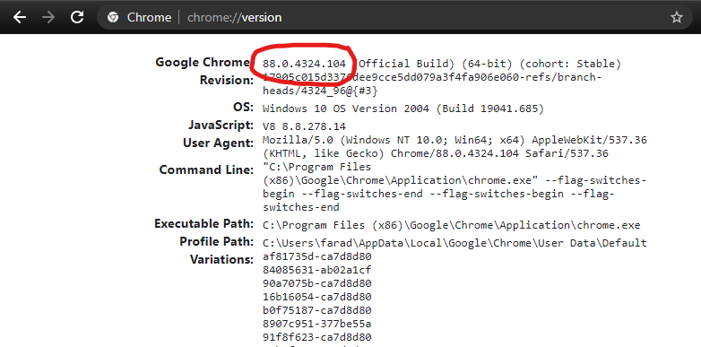

# Splinter Web Scraping Install Guide
Web scraping is a method of data gathering by using automation to pull information from a web page. Splinter is a Python module for web automation that can be used for this purpose. Splinter works by using a seperate program called ChromeDriver to hijack a Google Chrome session and execute pre-programmed actions.

## 1) Google Chrome


Use [this link](https://www.google.com/chrome/) to download or update Google Chrome.

## 2) ChromeDriver
After installing Chrome, visit `chrome://version` to check your version.



Visit the ChromeDriver [downloads page](https://chromedriver.chromium.org/downloads) to download a matching ChromeDriver version for your operating system. After downloading, extract (unzip) the file. You will now need to add ChromeDriver to your computer's PATH environment variable. The PATH variable holds information about where the computer can find exectuble programs. Learn more about the PATH [here](https://en.wikipedia.org/wiki/PATH_(variable)).

Start by opening a terminal and creating a new folder for the webdriver.
```
cd ~/
mkdir webdrivers
```
Next, move the extracted chromedriver to the webdrivers folder.
```
mv Downloads/chromedriver.exe webdrivers/
```
Now you can add the webdrivers folder to your path.
### Mac
```
echo "PATH=$PATH:/Users/YOUR USER/webdrivers/" >> ~/.bash_profile
```
### Windows
```
$PATH=$PATH:/c/Users/YOUR USER/webdrivers
```

Next, restart your terminal and run the following to test the installation: 
```
chromedriver
```

## 3) Splinter install
To install splinter run the following pip command in your terminal:
```
pip install splinter
```

To learn more about how to use splinter, check out the [docs](https://splinter.readthedocs.io/en/latest/index.html).